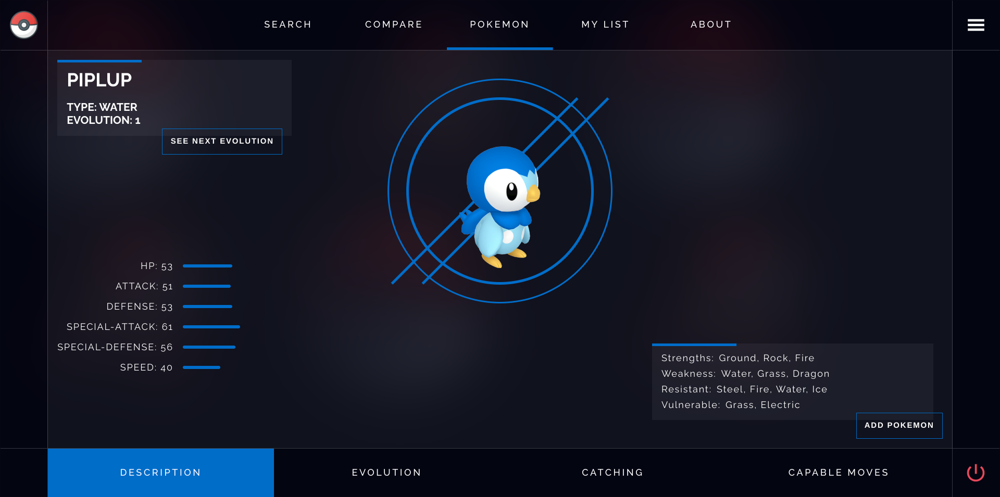

# 🔥 Pokédex v1 Project

A modern, interactive Pokédex web application built with React, TypeScript, and Firebase. Explore the world of Pokémon with advanced search capabilities, personal collections, and detailed Pokémon information.



## ✨ Features

### 🔍 **Search & Discovery**

- **Smart Search**: Find Pokémon by name with real-time search suggestions
- **Browse All Pokémon**: Explore the complete Pokédex with infinite scroll
- **Random Pokémon**: Discover new Pokémon with randomized suggestions

### 📊 **Pokémon Comparison**

- **Side-by-Side Comparison**: Compare stats, types, and abilities between multiple Pokémon
- **Visual Stats Display**: Easy-to-read charts and graphics for Pokémon statistics
- **Type Effectiveness**: Understand strengths and weaknesses

### 📝 **Personal Collection**

- **My List**: Save your favorite Pokémon to a personal collection
- **Google Authentication**: Secure login with Firebase Authentication
- **Cloud Storage**: Your collection is saved and synced across devices
- **Easy Management**: Add and remove Pokémon from your collection with one click

### 📖 **Detailed Information**

- **Comprehensive Pokémon Profiles**: View detailed stats, types, abilities, and descriptions
- **Evolution Chains**: Explore Pokémon evolution paths and requirements
- **Move Sets**: Browse available moves and their details
- **Catching Information**: Learn about catch rates and habitat information

### 🎨 **Modern UI/UX**

- **Responsive Design**: Optimized for desktop, tablet, and mobile devices
- **Dark Theme**: Eye-friendly dark interface
- **Smooth Animations**: Engaging transitions and loading states
- **Toast Notifications**: Real-time feedback for user actions

## 🚀 Getting Started

### Prerequisites

Before you begin, ensure you have the following installed:

- **Node.js** (version 14.0 or higher)
- **npm** or **yarn** package manager
- **Git** for version control

### Installation

1. **Clone the repository**

   ```bash
   git clone https://github.com/yourusername/pokedex-v1-project.git
   cd pokedex-v1-project
   ```

2. **Install dependencies**

   ```bash
   # Using npm
   npm install

   # Using yarn
   yarn install
   ```

3. **Firebase Configuration** (Optional - for authentication features)

   - Create a Firebase project at [Firebase Console](https://console.firebase.google.com/)
   - Enable Authentication with Google provider
   - Enable Firestore Database
   - Update `src/utils/firebaseConfig.ts` with your Firebase configuration

4. **Start the development server**

   ```bash
   # Using npm
   npm start

   # Using yarn
   yarn start
   ```

5. **Open your browser**
   Navigate to `http://localhost:3000` to view the application

## 🎮 Usage Guide

### Basic Navigation

- **Home/Search**: Browse and search for Pokémon
- **Compare**: Compare multiple Pokémon side by side
- **My List**: View your saved Pokémon collection (requires login)
- **About**: Learn more about the project

### Searching for Pokémon

1. Use the search bar in the navigation to find Pokémon by name
2. Browse the main page to see random Pokémon suggestions
3. Click on any Pokémon card to view detailed information

### Managing Your Collection

1. Click the "Login with Google" button to authenticate
2. On any Pokémon card or detail page, click the "Add to List" button
3. Access your collection through the "My List" navigation item
4. Remove Pokémon from your collection using the remove button

### Comparing Pokémon

1. Navigate to the Compare page
2. Search and select Pokémon to compare
3. View side-by-side statistics and information
4. Add or remove Pokémon from the comparison

## 📁 Project Structure

```
pokedex-v1-project/
├── public/                 # Static assets
│   ├── index.html         # Main HTML template
│   ├── favicon.ico        # App icon
│   └── manifest.json      # PWA manifest
├── src/
│   ├── app/               # Redux store configuration
│   │   ├── hooks.ts       # Custom Redux hooks
│   │   ├── store.ts       # Store configuration
│   │   ├── slices/        # Redux slices
│   │   └── reducers/      # Async thunks and reducers
│   ├── components/        # Reusable UI components
│   │   ├── Background.tsx # Animated background
│   │   ├── Loader.tsx     # Loading spinner
│   │   ├── Login.tsx      # Authentication component
│   │   └── PokemonCardGrid.tsx # Pokémon grid display
│   ├── pages/             # Main application pages
│   │   ├── Search.tsx     # Search and browse page
│   │   ├── Compare.tsx    # Pokémon comparison page
│   │   ├── MyList.tsx     # User's collection page
│   │   ├── Pokemon.tsx    # Individual Pokémon details
│   │   └── About.tsx      # About page
│   ├── sections/          # Layout components
│   │   ├── Navbar.tsx     # Navigation bar
│   │   ├── Footer.tsx     # Footer component
│   │   └── Wrapper.tsx    # Page wrapper
│   ├── scss/              # Styling files
│   │   ├── base/          # Base styles
│   │   ├── components/    # Component styles
│   │   ├── pages/         # Page-specific styles
│   │   └── utils/         # Utility styles
│   ├── utils/             # Utility functions and configurations
│   │   ├── firebaseConfig.ts # Firebase setup
│   │   ├── constants.ts   # App constants
│   │   ├── types.ts       # TypeScript type definitions
│   │   └── index.ts       # Utility functions
│   ├── assets/            # Images and static assets
│   └── App.tsx            # Main application component
├── app_screenshots/       # Application screenshots
├── package.json          # Dependencies and scripts
├── tsconfig.json         # TypeScript configuration
└── README.md             # Project documentation
```

## 🛠️ Technology Stack

### Frontend

- **React 18** - Modern React with hooks and functional components
- **TypeScript** - Type-safe JavaScript for better development experience
- **React Router DOM** - Client-side routing and navigation
- **SCSS/Sass** - Advanced CSS preprocessing for better styling

### State Management

- **Redux Toolkit** - Efficient Redux logic with less boilerplate
- **React Redux** - Official React bindings for Redux

### Backend & Database

- **Firebase Authentication** - Secure Google OAuth integration
- **Firestore** - NoSQL cloud database for user collections
- **PokéAPI** - RESTful API for Pokémon data

### UI/UX Libraries

- **React Icons** - Beautiful icon library
- **React Toastify** - Elegant toast notifications
- **React Infinite Scroll** - Smooth infinite scrolling experience
- **Extract Colors** - Dynamic color extraction from images

### Development Tools

- **Create React App** - Zero-configuration React setup
- **Axios** - Promise-based HTTP client
- **ESLint** - Code linting and formatting
- **Jest & React Testing Library** - Testing framework

### Deployment

- **Netlify** - Fast and reliable hosting platform

## 📋 Available Scripts

In the project directory, you can run:

### `npm start` or `yarn start`

Runs the app in development mode. Open [http://localhost:3000](http://localhost:3000) to view it in the browser.

### `npm test` or `yarn test`

Launches the test runner in interactive watch mode.

### `npm run build` or `yarn build`

Builds the app for production to the `build` folder. The build is minified and optimized for best performance.

### `npm run eject` or `yarn eject`

**Note: This is a one-way operation. Once you eject, you can't go back!**

## 🤝 Contributing

We welcome contributions to the Pokédex project! Here's how you can help:

### Getting Started

1. **Fork the repository** on GitHub
2. **Clone your fork** locally
3. **Create a new branch** for your feature or bug fix
4. **Make your changes** following our coding standards
5. **Test your changes** thoroughly
6. **Submit a pull request** with a clear description

### Development Guidelines

- Follow the existing code style and conventions
- Write meaningful commit messages
- Add tests for new features
- Update documentation as needed
- Ensure your code passes all existing tests

### Code Style

- Use TypeScript for all new components
- Follow React functional component patterns
- Use meaningful variable and function names
- Add comments for complex logic
- Keep components small and focused

### Reporting Issues

If you find a bug or have a feature request:

1. Check if the issue already exists
2. Create a detailed issue description
3. Include steps to reproduce (for bugs)
4. Add screenshots if applicable

## 📄 License

This project is licensed under the MIT License - see the [LICENSE](LICENSE) file for details.

### MIT License Summary

- ✅ Commercial use
- ✅ Modification
- ✅ Distribution
- ✅ Private use
- ❌ Liability
- ❌ Warranty

## 🙏 Acknowledgments

- **PokéAPI** - For providing comprehensive Pokémon data
- **Firebase** - For authentication and database services
- **The Pokémon Company** - For creating the amazing Pokémon universe
- **React Community** - For the excellent ecosystem and tools
- **Open Source Contributors** - For the libraries that make this project possible

## 📞 Contact & Support

- **Developer**: [Pakon Poomson]
- **Email**: [pakon.poomson@gmail.com]
- **GitHub**: [@Praciller](https://github.com/Praciller)
- **Project Link**: [https://github.com/Praciller/pokedex-v1-project](https://github.com/Praciller/pokedex-v1-project)

## 🚀 Deployment

### Netlify Deployment

This project is configured for easy deployment on Netlify:

1. **Connect your repository** to Netlify
2. **Set build command**: `npm run build` or `yarn build`
3. **Set publish directory**: `build`
4. **Deploy** - Netlify will automatically build and deploy your app

### Environment Variables

For production deployment, make sure to set up your Firebase configuration securely using environment variables instead of hardcoding them in the source code.

## 🔮 Future Enhancements

- 🌟 **Favorites System** - Star rating for Pokémon
- 🎮 **Team Builder** - Create and manage Pokémon teams
- 📊 **Advanced Statistics** - More detailed stat comparisons
- 🔔 **Push Notifications** - Updates on new Pokémon releases
- 🌍 **Offline Support** - PWA capabilities for offline usage
- 🎨 **Theme Customization** - Multiple color themes
- 📱 **Mobile App** - React Native version

---

<div align="center">
  <p>Made with ❤️ by Pokémon fans, for Pokémon fans</p>
  <p>⭐ Star this repository if you found it helpful!</p>
</div>
